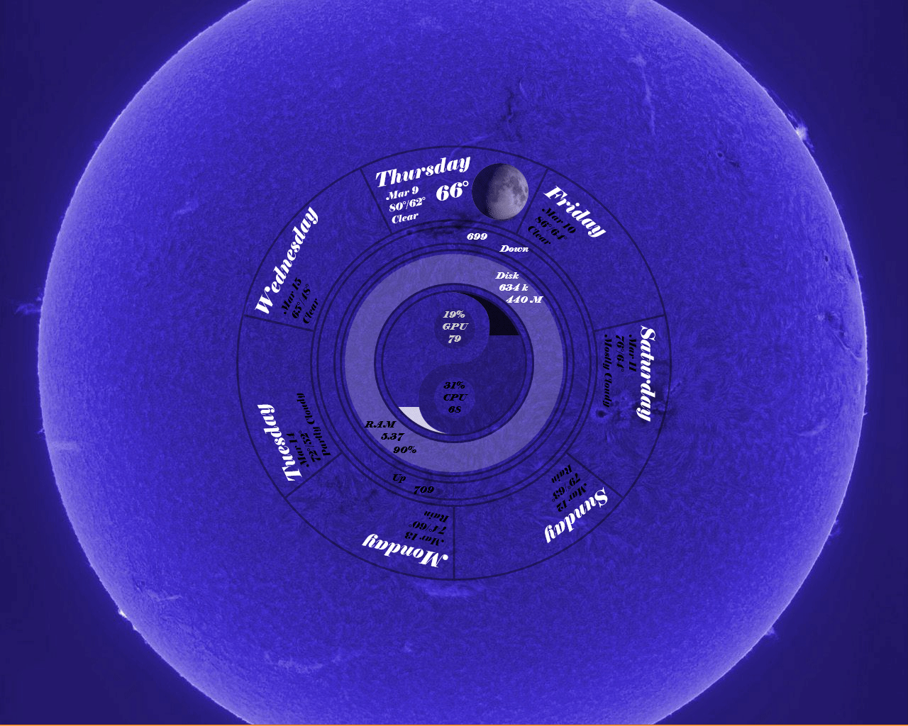

# Eccentricity0
####An un-eccentric Rainmeter skin

## Features

### Weather
- Full 7 day forecast
- Current temperature and condition
- If after sunset, the current phase of the moon is displayed
- Different tooltips for [present](demo/tooltippresent.jpg) and [future](demo/tooltipfuture.jpg) days (this was a huge pain to accomplish)

### Network stats
- Current network upload/download speeds
  - You have a choice of two variants for the graphical representation: 
    - [NetArc](demo/arcdemo.gif) (The length of the arc represents the percentage of maximum up/down speed)
    - [NetSpin](demo/netspindemo.gif) (The speed of the arc represents the current maximum up/down speed)
      - NetSpin is a lot more resource intsensive in order achieve smooth animation, beware.

### Memory stats
- RAM usage is displayed with the thickness of the inner ring

### Disk stats
- Current disk read/write is shown with two arcs that inscribe the inner ring
- Since there is no good metric for "maximum" disk throughput the skin will store the highest recorded
  - The highest recorded rate can be reset by clicking it

### CPU/GPU stats
- CPU and GPU have their current usage displayed as half of the yin-yang image.
- CPU and GPU temperatures

## Installation

- Download and install the [.rmskin](https://github.com/spanktastic2120/Eccentricity0/raw/master/Eccentricity0_1.0.rmskin)
- Download and install [Open Hardware Monitor](http://openhardwaremonitor.org/downloads/)
- Go to WeatherUnderground and sign up for a *free* developer [api key](https://www.wunderground.com/weather/api/d/pricing.html)
- (Optional) Download and install [MSI Afterburner](https://www.msi.com/page/afterburner)

#### Still with me?
Open the `Variables.inc` file and enter values for
 - `NetUp`    (Maximum network upload speed in bits per second)
 - `NetDown`  (Maximum network download speed in bits per second)
 - `Zip`      (Your local ZIP code)
 - `APIKey`   (The API Key from WeatherUnderground)
 - `CPUName`  (The name of your CPU as it appears in Open Hardware Monitor, ex: `Intel Core i7 920`)
 - `GPUName`  (The name of your GPU as it appears in Open Hardware Monitor, ex: `NVIDIA GeForce 9800 GT`)
 
 You can now load the included layout `Eccentricity0 Default` without fear of crashing Rainmeter. 
